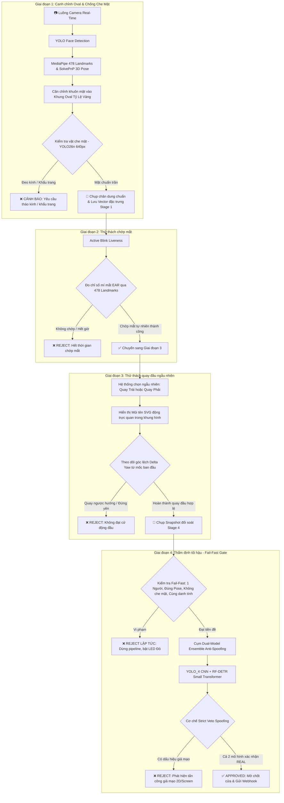

# 🛡️ Hệ Thống eKYC Sinh Trắc Học Khuôn Mặt & Chống Giả Mạo (AI Server + ESP32-CAM)

Hệ thống xác thực danh tính điện tử (**eKYC**) toàn diện chuẩn ngân hàng (FinTech/Banking-Grade), kết hợp giữa phần cứng nhúng **ESP32-CAM / ESP32-S3** và máy chủ phân tích **AI Ensemble (YOLO_4 + RF-DETR Small Transformer + YOLO26n Occlusion + MediaPipe Face Mesh)** với cơ chế Active Liveness & Fail-Fast Early Rejection.

---

## 📁 Cấu Trúc Dự Án

```text
ekyc_release/
│
├── esp32_firmware/            # Mã nguồn PlatformIO cho vi điều khiển ESP32-CAM / ESP32-S3
│   ├── src/                   # Logic chương trình chính, WiFi, Camera, LED RGB WS2812
│   ├── include/               # Header cấu hình (HardwareController.h, EKYCService.h, web_ui.h)
│   ├── platformio.ini         # Cấu hình nạp firmware PlatformIO
│   └── README.md              # Hướng dẫn chi tiết nạp code phần cứng
│
├── server_module/             # Máy chủ AI Backend & Giao diện Web Điều Khiển
│   ├── app.py                 # FastAPI REST API Entry Point (:8000)
│   ├── pipeline_server.py     # Lõi Pipeline thẩm định 8 tiêu chí eKYC & Fail-Fast Gate
│   ├── config.py              # Toàn bộ tham số cấu hình: Ngưỡng góc Pose, EAR, Occlusion, Ensemble
│   ├── nodejs_server_receiver.js # Node.js Stream Relay & Web Proxy (:3000) (Pure Standard Library)
│   ├── nodejs_client_example.js  # Code mẫu gọi API từ Node.js Backend
│   ├── package.json           # Cấu hình dự án Node.js (0 npm dependencies)
│   ├── components/            # Các module xử lý thị giác máy tính:
│   │   ├── face_detection/           # YOLOv8 Face Detector
│   │   ├── landmark_detection/       # MediaPipe 478 3D Landmarks
│   │   ├── pose_validation/          # SolvePnP 3D Pose Estimator (Yaw, Pitch, Roll)
│   │   ├── face_alignment_crop/      # Affine Transformation & Golden Ratio Oval Fitting
│   │   ├── face_occlusion_detector.py # YOLO26n phát hiện Kính & Khẩu trang (100% Offline)
│   │   ├── ensemble_anti_spoof.py    # Cụm Ensemble YOLO_4 + RF-DETR Small Transformer
│   │   ├── local_onnx_models.py      # ONNXRuntime High-Speed Runners (DML / CUDA / CPU)
│   │   └── head_movement/            # Bộ quản lý thử thách cử động đầu
│   ├── models/                # Trọng số các mô hình AI (.pt, .task, .onnx)
│   └── static/
│       ├── index.html         # Giao diện Web Full Telemetry (HUD, 3D Pose, Live EAR Chart)
│       └── simple.html        # Giao diện Web Kiosk Tinh Gọn (Chỉ giữ Oval & Mũi tên động)
│
├── requirements.txt           # Danh sách thư viện Python cần thiết
├── start_ai_server.bat        # Kịch bản khởi động FastAPI AI Server (:8000) trên Windows
├── start_nodejs_receiver.bat  # Kịch bản khởi động Node.js Relay Hub (:3000) trên Windows
├── .gitattributes             # Cấu hình Git LFS cho file trọng số mô hình lớn (.onnx, .pt, .task)
└── .gitignore                 # Loại trừ file build, cache và dữ liệu tạm thời
```

---

## ⚡ Quy Trình Thẩm Định 4 Giai Đoạn (Pipeline Flow)



---

## 🎯 Các Điểm Cải Tiến Trọng Tâm

1. **Khắc Chế Triệt Để Kính Mắt & Khẩu Trang (Policy A - Zero Tolerance)**:
   - Sử dụng mô hình **YOLO26n** nạp trực tiếp qua **ONNXRuntime** với độ phân giải **640x640** (giữ trọn độ nét gọng kính).
   - Cơ chế phân định đa tầng nhạy bén (`conf_threshold = 0.32`): Phát hiện chính xác kính cận trong suốt, kính không gọng, kính râm, kính thuốc, khẩu trang vải và khẩu trang kéo dưới cằm.
2. **Cử Động Đầu Tự Nhiên & Mũi Tên Chỉ Dẫn Động**:
   - Sử dụng thuật toán đo góc quay tương đối $\Delta \text{Yaw}$ so với góc ban đầu: Người dùng chỉ cần nhích đầu tự nhiên $6.5^\circ$ theo đúng hướng là hệ thống ghi nhận thành công, loại bỏ hiện tượng giật cục hay bắt quay quá đà.
   - Giao diện hiển thị mũi tên động thuần SVG bên trong khung camera, không dùng chữ gây rối mắt.
3. **Cơ Chế Fail-Fast Early Rejection**:
   - Mọi vi phạm (hết giờ, tráo người, đeo kính, góc mặt sai) đều bị từ chối ngay lập tức, không tiêu tốn tài nguyên chạy mô hình nặng.
4. **Node.js Relay Hub Thuần Túy (Zero Dependencies)**:
   - Server Node.js trung gian (`:3000`) sử dụng 100% thư viện chuẩn tích hợp (`http`, `fs`, `path`), **không yêu cầu bất kỳ lệnh `npm install` nào**.

---

## 📊 Đánh Giá Thực Nghiệm Cụm Dual-Model Ensemble (ISO/IEC 30107-3)

Hệ thống được kiểm thử thực nghiệm trên tập dữ liệu kiểm thử độc lập (`112` mẫu test đa dạng điều kiện ánh sáng, góc chụp và các hình thức tấn công màn hình/in ấn):

| Chỉ Số Đánh Giá (Metrics) | Định Nghĩa | Kết Quả Thực Nghiệm |
| :--- | :--- | :---: |
| **Kiến trúc mô hình** | Kết hợp song song 2 mạng học sâu | **YOLO_4 + RF-DETR Small (Transformer)** |
| **Tổng số mẫu kiểm thử** | Tập dữ liệu độc lập (Test split) | **112 ảnh** |
| **Phân bố Ground Truth** | Tỷ lệ ảnh Thật (**Real**) / Giả mạo (**Spoof**) | **73 / 39** |
| **APCER (Attack Presentation Error)** | Tỷ lệ kẻ giả mạo lọt qua hệ thống *(Càng thấp càng an toàn)* | **0.00%** *(Bảo mật tuyệt đối — 39/39 cuộc tấn công bị chặn)* |
| **Độ chuẩn xác Real (Precision)** | Xác suất một lượt duyệt Real là đúng người thật | **100.00%** *(Không có bất kỳ ca giả mạo nào bị duyệt nhầm)* |
| **BPCER (Bona Fide Error Rate)** | Tỷ lệ người dùng thật bị từ chối do chính sách Veto khắt khe | **57.53%** *(Ưu tiên tối đa cho an ninh FinTech)* |
| **Độ trễ trung bình (Avg Latency)** | Thời gian thẩm định Dual-Model (chỉ chạy 1 lần ở Stage 4) | **~950 ms** / lượt |

---

## 🚀 Hướng Dẫn Cài Đặt & Khởi Chạy

### 1. Yêu Cầu Môi Trường
- **Hệ điều hành**: Windows 10/11 hoặc Linux (Ubuntu 20.04+)
- **Python**: `3.9` đến `3.11` (Khuyên dùng `3.11`)
- **Node.js**: `v16+` (Tùy chọn nếu dùng luồng Stream Relay `:3000`)
- **VS Code** với tiện ích mở rộng **PlatformIO IDE** (dành cho nạp firmware ESP32)

### 2. Cài Đặt Thư Viện Python
Mở Terminal trong thư mục `ekyc_release` và chạy:
```bash
pip install -r requirements.txt
```

> [!TIP]
> **Tăng tốc phần cứng GPU (Tùy chọn):**
> - **Windows (Card AMD / Intel / NVIDIA DirectX 12):**
>   ```bash
>   pip install onnxruntime-directml
>   ```
> - **Linux / Windows (Card NVIDIA CUDA):**
>   ```bash
>   pip install onnxruntime-gpu
>   ```

### 3. Về Thư Viện Node.js
Module Node.js Relay Hub (`server_module/nodejs_server_receiver.js`) được thiết kế **thuần 100% bằng thư viện tích hợp sẵn** của Node.js.  
👉 **Không cần chạy bất kỳ lệnh `npm install` nào!**

---

### 4. Khởi Chạy Hệ Thống

#### Cách 1: Khởi động nhanh qua file kịch bản (Windows)
Nhấp đúp chuột vào file tương ứng:
1. `start_ai_server.bat` $\rightarrow$ Khởi chạy FastAPI AI Server tại cổng `:8000`.
2. `start_nodejs_receiver.bat` $\rightarrow$ Khởi chạy Node.js Stream Relay & Web Hub tại cổng `:3000`.

#### Cách 2: Khởi động thủ công qua dòng lệnh
Mở 2 cửa sổ Terminal:

- **Cửa sổ 1: FastAPI AI Server (:8000)**
  ```bash
  python -m uvicorn server_module.app:app --host 0.0.0.0 --port 8000
  ```

- **Cửa sổ 2: Node.js Relay Hub (:3000 - Tùy chọn khi dùng ESP32)**
  ```bash
  node server_module/nodejs_server_receiver.js
  ```

---

## 🖥️ Trải Nghiệm Giao Diện Người Dùng

Sau khi khởi chạy server, bạn có thể truy cập các đường dẫn sau trên trình duyệt:

| Giao Diện | Đường Dẫn | Đối Tượng Sử Dụng & Mục Đích |
| :--- | :--- | :--- |
| **Kiosk Simple UI** | [http://localhost:8000/simple](http://localhost:8000/simple) | **Giao diện người dùng cuối**: Thiết kế tinh gọn, hiện đại, chỉ hiển thị khung oval, thanh hướng dẫn và mũi tên động in-frame. |
| **Full Debug HUD** | [http://localhost:8000/](http://localhost:8000/) | **Giao diện kỹ thuật viên / Admin**: Hiển thị bảng HUD Telemetry, đồ thị EAR thời gian thực, góc nghiêng 3D Pose Euler, điểm phân loại chi tiết từng mô hình. |
| **Swagger API Docs** | [http://localhost:8000/docs](http://localhost:8000/docs) | Tài liệu tương tác API chuẩn OpenAPI / Swagger. |

---

## 📡 Danh Mục API REST (FastAPI AI Server)

| Phương thức | Endpoint | Mô tả chức năng |
| :--- | :--- | :--- |
| `POST` | `/api/v1/align-face` | Quét kiểm tra khuôn mặt trong oval, kiểm tra 3D Pose, phát hiện kính mắt & khẩu trang thời gian thực. |
| `POST` | `/api/v1/capture-face` | Chụp và lưu trữ vector đặc trưng khuôn mặt chuẩn Stage 1 (có kiểm tra `force_fresh`). |
| `POST` | `/api/v1/liveness/init-session` | Khởi tạo phiên kiểm tra Active Liveness với ID phiên duy nhất. |
| `POST` | `/api/v1/liveness/blink-frame` | Xử lý từng frame cho thử thách chớp mắt (Stage 2). |
| `POST` | `/api/v1/liveness/start-head` | Bắt đầu thử thách quay đầu ngẫu nhiên (Turn Left / Right) (Stage 3). |
| `POST` | `/api/v1/liveness/update-head` | Cập nhật góc quay đầu thời gian thực so với mốc xuất phát ban đầu. |
| `POST` | `/api/v1/verify` | Thẩm định tổng hợp cuối cùng qua Dual-Model Ensemble (Stage 4) và xuất kết quả Approved/Rejected. |

---

## 🔌 Nạp Firmware Cho ESP32-CAM / ESP32-S3

1. Mở thư mục `esp32_firmware` bằng **VS Code** (đã cài tiện ích PlatformIO IDE).
2. Mở file `include/HardwareController.h` hoặc `src/main.cpp`, cấu hình thông số mạng WiFi và địa chỉ Server:
   ```cpp
   const char* ssid = "YOUR_WIFI_NAME";
   const char* password = "YOUR_WIFI_PASSWORD";
   const char* server_url = "http://192.168.1.X:3000/api/stream/frame";
   ```
3. Kết nối board ESP32 vào cổng USB máy tính và nhấn biểu tượng **Upload** trên thanh trạng thái của PlatformIO.

---

## 📤 Hướng Dẫn Đẩy Lên GitHub Với Git LFS

> [!IMPORTANT]
> Các file trọng số AI trong thư mục `server_module/models/` (đặc biệt là `weights.onnx` nặng ~108 MB) vượt quá giới hạn 100 MB của GitHub. Do đó, bạn cần sử dụng **Git LFS**:

```bash
# 1. Cài đặt Git LFS (chỉ thực hiện 1 lần trên máy)
git lfs install

# 2. Đăng ký theo dõi các định dạng file mô hình lớn
git lfs track "*.onnx" "*.pt" "*.task"

# 3. Thêm file và commit
git add .
git commit -m "feat: standardize eKYC AI pipeline and requirements"

# 4. Đẩy mã nguồn lên repository
git push origin main
```
