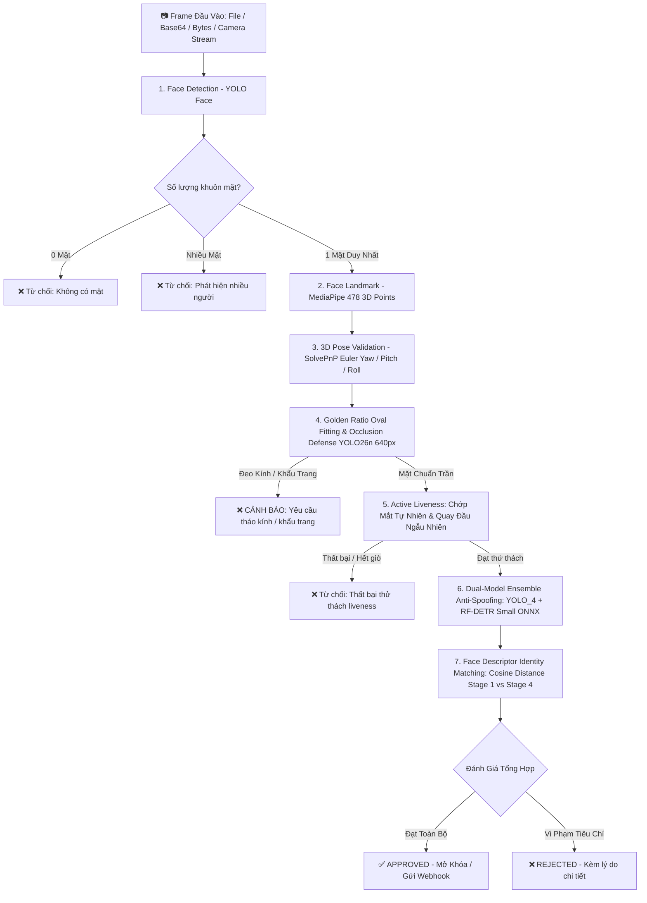

# 🛡️ E-KYC Server Module (AI Ensemble & REST API Hub)

Module máy chủ chuyên trách tính toán Thị giác máy tính (Computer Vision) và Trí tuệ nhân tạo (AI Deep Learning) cho hệ thống xác thực sinh trắc học khuôn mặt eKYC, tích hợp cụm **Dual-Model Ensemble Anti-Spoofing (YOLO_4 + RF-DETR Small Transformer)** và **YOLO26n Occlusion Defense**.

Module này được thiết kế theo dạng **gói độc lập (Self-contained Package)**, sẵn sàng để triển khai trực tiếp lên server hoặc container Docker, hỗ trợ kết nối đa nền tảng (Web App, Mobile App, Node.js Backend, vi điều khiển ESP32-CAM).

---

## 📑 Mục Lục
1. [Kiến Trúc & Quy Trình Xử Lý AI](#1-kiến-trúc--quy-trình-xử-lý-ai)
2. [Danh Mục Mô Hình AI (AI Weights Inventory)](#2-danh-mục-mô-hình-ai-ai-weights-inventory)
3. [Cấu Trúc Thư Mục `server_module/`](#3-cấu-trúc-thư-mục-server_module)
4. [Hướng Dẫn Cài Đặt & Triển Khai](#4-hướng-dẫn-cài-đặt--triển-khai)
5. [Tích Hợp Trực Tiếp Với Python](#5-tích-hợp-trực-tiếp-với-python)
6. [Tích Hợp Với Hệ Thống Node.js Backend](#6-tích-hợp-với-hệ-thống-nodejs-backend)
7. [Cấu Trúc Báo Cáo & Dữ Liệu Đầu Ra](#7-cấu-trúc-báo-cáo--dữ-liệu-đầu-ra)

---

## 1. Kiến Trúc & Quy Trình Xử Lý AI

Quy trình xử lý tuân thủ chặt chẽ tiêu chuẩn eKYC FinTech/Ngân hàng với cơ chế **Fail-Fast Early Rejection**:



### Các tiêu chí an toàn bắt buộc:
1. **`face_detected`**: Có mặt người trong khung hình.
2. **`single_face`**: Duy nhất 1 người (không bị người đứng sau/xen vào).
3. **`pose_valid`**: Góc mặt thẳng chuẩn (Yaw $\le 20^\circ$, Pitch $\le 18^\circ$, Roll $\le 15^\circ$).
4. **`face_in_oval`**: Khuôn mặt nằm trọn vẹn trong khung oval tỷ lệ vàng ($45\% - 85\%$ diện tích oval).
5. **`occlusion_free`**: Tuyệt đối không đeo kính (kính cận trong suốt, gọng mảnh, kính râm) và khẩu trang.
6. **`blink_passed`**: Người dùng chớp mắt tự nhiên (đo tỷ lệ co giãn mí mắt EAR qua 478 landmarks).
7. **`head_movement_passed`**: Người dùng thực hiện quay đầu theo hướng chỉ định ($\Delta \text{Yaw} \ge 6.5^\circ$).
8. **`anti_spoof_real`**: Cụm Ensemble (YOLO_4 + RF-DETR Small) đồng thuận xác nhận `REAL` (0.00% APCER).
9. **`same_identity`**: Khuôn mặt ở Stage 1 và Stage 4 thuộc cùng một người (Cosine Distance $\le 0.40$).

---

## 2. Danh Mục Mô Hình AI (AI Weights Inventory)

Hệ thống hoạt động **100% Offline** tại máy chủ nội bộ mà không phụ thuộc vào bất kỳ dịch vụ đám mây bên ngoài nào:

| Tên File Model | Vị Trí Trong `server_module/models/` | Kích Thước | Nhiệm Vụ Kỹ Thuật |
| :--- | :--- | :---: | :--- |
| **`Face_Detection.pt`** | `models/Face_Detection.pt` | ~6 MB | Mô hình YOLOv8 Face phát hiện vị trí khuôn mặt với tốc độ cao. |
| **`face_landmarker.task`** | `models/face_landmarker.task` | ~3.8 MB | Trích xuất 478 tọa độ 3D landmarks phục vụ đo EAR chớp mắt và giải PnP 3D Pose. |
| **`yolo_anti_spoof_v4_official.pt`** | `models/anti_spoof/yolo/...` | ~6.2 MB | Mô hình 1 của cụm Ensemble: YOLO_4 CNN phân biệt ảnh in 2D, màn hình điện thoại/laptop. |
| **`weights.onnx` (RF-DETR)** | `models/anti_spoof/rf_detr/rfdetr_small_official/...` | ~108 MB | Mô hình 2 của cụm Ensemble: RF-DETR Small Transformer phát hiện gian lận chiều sâu sinh trắc học. |
| **`weights.onnx` (YOLO26n)** | `models/face_occlusion/yolo26n_glass_and_mask_official/...` | ~9.8 MB | YOLO26n Occlusion phân loại chuẩn 4 classes (`glass`, `mask`, `no_glass`, `no_mask`). |

---

## 3. Cấu Trúc Thư Mục `server_module/`

```text
server_module/
│
├── app.py                     # FastAPI REST API Hub (:8000)
├── pipeline_server.py         # Lõi Pipeline thẩm định 8 tiêu chí eKYC & Fail-Fast Gate
├── config.py                  # File cấu hình tham số trung tâm
├── nodejs_server_receiver.js  # Node.js Stream Ingest & Relay Hub (:3000)
├── nodejs_client_example.js   # Code mẫu gọi API từ Node.js Backend (Native fetch)
├── package.json               # Cấu hình dự án Node.js (0 npm dependencies)
│
├── components/                # Thư viện thành phần Computer Vision nội bộ
│   ├── face_detection/               # YOLO Face Detector
│   ├── landmark_detection/           # MediaPipe 478 Landmarks Engine
│   ├── pose_validation/              # SolvePnP 3D Head Pose
│   ├── face_alignment_crop/          # Affine Align & Oval Fit Check
│   ├── face_occlusion_detector.py     # YOLO26n Glass & Mask Defense
│   ├── ensemble_anti_spoof.py        # Ensemble YOLO_4 + RF-DETR
│   ├── local_onnx_models.py          # ORT Inference Runners (100% Offline)
│   ├── identity_verifier.py          # Face Embedding Matching
│   └── head_movement/                # Head Movement Challenge Manager
│
├── models/                    # Lưu trữ toàn bộ file weights AI (.pt, .task, .onnx)
└── static/
    ├── index.html             # Giao diện Web Full Debug HUD & Telemetry
    └── simple.html            # Giao diện Web Kiosk Tinh Gọn (Khung Oval & Mũi tên động)
```

---

## 4. Hướng Dẫn Cài Đặt & Triển Khai

### Bước 1: Cài đặt thư viện Python phụ thuộc
Chạy lệnh sau trên máy chủ (Linux / Windows Server):
```bash
pip install -r ../requirements.txt
```

### Bước 2: Tùy chọn tăng tốc GPU với ONNX Runtime (Nếu có card đồ họa)
- Trên Windows (DirectX 12 cho AMD / Intel / NVIDIA):
  ```bash
  pip install onnxruntime-directml
  ```
- Trên Linux / Windows có GPU NVIDIA CUDA:
  ```bash
  pip install onnxruntime-gpu
  ```

### Bước 3: Khởi chạy dịch vụ
```bash
python -m uvicorn server_module.app:app --host 0.0.0.0 --port 8000 --workers 1
```

Sau khi khởi chạy:
- **Giao diện Kiosk**: [http://localhost:8000/simple](http://localhost:8000/simple)
- **Giao diện Kỹ thuật**: [http://localhost:8000/](http://localhost:8000/)
- **Swagger API Docs**: [http://localhost:8000/docs](http://localhost:8000/docs)

---

## 5. Tích Hợp Trực Tiếp Với Python

Nếu hệ thống backend của bạn viết bằng Python, bạn có thể gọi trực tiếp module nội bộ:

```python
from server_module import EKYCPipelineServer
import cv2

# 1. Khởi tạo pipeline server (tự động load tất cả mô hình AI)
pipeline = EKYCPipelineServer()

# 2. Căn chỉnh khuôn mặt & kiểm tra kính mắt / khẩu trang từ khung hình camera
frame = cv2.imread("frame.jpg")
align_result = pipeline.validate_face_alignment(frame)
print("Trong khung Oval:", align_result["fit_oval"])
print("Bị che mặt/Đeo kính:", align_result["is_occluded"])
print("Hướng dẫn:", align_result["message"])

# 3. Thẩm định tổng hợp cuối cùng qua Ensemble Anti-Spoofing
verify_result = pipeline.verify_identity(
    frame=frame,
    img_id="USER_001",
    user_id="ID_9999",
    blink_passed=True,
    head_movement_passed=True,
    head_action_name="TURN_LEFT"
)
print("Kết quả duyệt:", verify_result["final_decision"]["verdict"]) # APPROVED / REJECTED
```

---

## 6. Tích Hợp Với Hệ Thống Node.js Backend

Dự án cung cấp sẵn tệp mẫu [**`nodejs_client_example.js`**](nodejs_client_example.js) minh họa cách gọi toàn bộ REST API của FastAPI AI Server từ Node.js (Express, NestJS, Fastify...) bằng **Native `fetch` và `FormData`** chuẩn của Node.js 18+:

```javascript
// Gửi ảnh sang FastAPI AI Server (:8000) để thẩm định
async function verifyWithAI(imageFilePath) {
  const fs = require('fs');
  const path = require('path');

  const fileBuffer = fs.readFileSync(imageFilePath);
  const fileBlob = new Blob([fileBuffer], { type: 'image/jpeg' });

  const formData = new FormData();
  formData.append('file', fileBlob, path.basename(imageFilePath));
  formData.append('img_id', `TX_${Date.now()}`);
  formData.append('user_id', 'USER_12345');
  formData.append('blink_passed', 'true');
  formData.append('head_passed', 'true');
  formData.append('head_action', 'TURN_LEFT');

  const response = await fetch('http://127.0.0.1:8000/api/v1/verify', {
    method: 'POST',
    body: formData
  });

  const result = await response.json();
  console.log('Phán quyết AI:', result.final_decision.verdict); // "APPROVED" hoặc "REJECTED"
  return result;
}
```

---

## 7. Cấu Trúc Báo Cáo & Dữ Liệu Đầu Ra

Khi hoàn thành thẩm định, hệ thống xuất báo cáo JSON chi tiết cấu trúc chuẩn:

```json
{
  "image_id": "USER_001",
  "timestamp": "2026-10-04 11:00:00",
  "final_decision": {
    "approved": true,
    "verdict": "APPROVED",
    "reasons": []
  },
  "criteria": {
    "face_detected": true,
    "single_face": true,
    "pose_valid": true,
    "face_in_oval": true,
    "occlusion_free": true,
    "blink_passed": true,
    "head_movement_passed": true,
    "anti_spoof_real": true,
    "same_identity": true
  },
  "ensemble_anti_spoof": {
    "label": "REAL",
    "confidence": 0.942,
    "yolo_detail": "REAL (0.95)",
    "rfdetr_detail": "real (0.93)",
    "agreement": true
  },
  "identity_match": {
    "same_person": true,
    "distance": 0.185,
    "threshold": 0.400
  }
}
```
